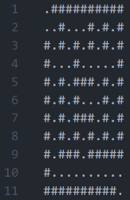
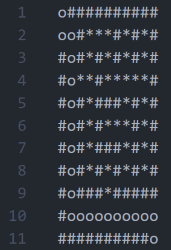

# 
Amazing Maze

## Context and project issues
This project was carried out as part of a course on algorithms in Python. The aim was to design and implement two maze generation algorithms (Kruskal and Backtracking) and two maze solving algorithms (A* and Backtracking).

The challenge of this project was to create a program capable of generating mazes efficiently, and then solving these mazes by finding the shortest path, using the appropriate algorithms.

## Usage
### Representation of the maze
Here is an example of how a 5x5 labyrinth is represented. 

Generated:

        

Solved: 

- Empty spaces to be used to reach the exit of the labyrinth are represented by the ' o ' character.
- Empty spaces that have been explored but are not part of the final path are represented by the ' * ' character.

### For generation 
- go to the 'generator' folder, into the 'generator.py' file and run the code
- on the terminal choose the generation algorithm between kruskal and backtracking
- choose the name and size of the maze to save as a text file
- the text file with generation maze will be stored in generator/maze_generated/ and backtracking or kruskal depending on the algorithm chosen

### For solving
- go to the 'solver' folder, into the 'solver.py' file and run the code
- on the terminal choose the generation algorithm between kruskal and backtracking
- write the name of the generation maze  associated with the chosen algorithm
- choose between backtracking and astar resolution algorithms
- choose a name to save the resolution in a text file
- the text file with maze resolution will be stored in solver/maze_solved/ and backtracking or astar depending on the algorithm chosen

## Solutions provided

### Maze generation
#### Backtracking algorithm
The Backtracking algorithm generates a maze at random by following these steps:

1) It starts at a starting cell and marks this cell as visited.
2) It randomly explores unvisited neighbors, removing walls between them.
3) If a dead-end is reached, the algorithm backtracks to find a new direction.
4) It continues until all cells have been visited.

I tried the backtracking algorithm with the recursive approach but quickly realized that it was going to be limited when generating large mazes, here's the error python gave me: 

"RecursionError: maximum recursion depth exceeded."

Python has a default recursion limit (limited by the maximum depth of the call stack). For large mazes, this can lead to the recursion limit being exceeded, causing this error. Recursive function calls can be expensive in terms of time and memory, making the approach less effective for large mazes.

So I performed the iterative approach with the 'while' loop, which is faster in Python due to its more efficient handling, and works well for large mazes as it limits the depth of recursion, thus avoiding a possible stack overflow for large mazes.

#### Kruskal algorithm
The Kruskal algorithm generates a loop-free maze by following these steps:

1) It creates all possible edges between the cells of the maze and shuffles them randomly.
2) It uses a Union-Find data structure to track sets of connected cells.
3) It selects one edge at a time and checks whether it connects two cells in different sets.
4) If they're not in the same set, it removes the wall between them, thus connecting them.
5) It repeats these steps until all cells are connected.

#### Comparison of the two algorithms
I've noticed that maze generation with the Kruskal algorithm is slower than with the Backtracking algorithm when tested with larger mazes. 

The Backtracking algorithm explores the maze along paths until it reaches a dead-end, then goes back to explore other paths. This works well for large mazes, as it doesn't require checking the whole maze at each step. The Kruskal algorithm, on the other hand, randomly selects passages and adds them to the maze, but has to check whether this creates loops in the maze. To check this, it sometimes has to traverse the entire maze, which becomes slower as the maze grows. 

### Maze solving
#### Backtracking algorithm
The Backtracking maze-solving algorithm finds a path through a maze by following these steps:

1) It starts from the starting cell, marking this cell as "o" to indicate the path.
2) He explores adjacent cells in the four possible directions.
3) If it finds a valid direction, it moves in that direction, marking the cell as "o" and adding it to a stack of paths traveled.
4) In the event of a dead end, the algorithm performs a "backtrack", removing the last cell from the stack, marking it as a return path "*" and moving backwards.
5) The process repeats until the exit cell is reached or all cells have been visited.

#### A* algorithm
The A* algorithm for solving mazes has not yet been implemented in this version of the project. I plan to add it later for optimal solving functionality. In the meantime, you can use the Backtracking maze-solving algorithm.

## Complexity analysis
### Maze Generation
#### Backtracking Algorithm
Time Complexity: O(n^2)

Explanation: This algorithm traverses all the cells of the maze, and for each cell, it performs a constant number of operations to decide on their next move or connection with neighbors. The size of the maze, n x n, determines the time complexity.
#### Kruskal Algorithm
Time Complexity: O(n^2)

Explanation: it creates all possible edges between the cells of the maze and shuffles them randomly. It uses a Union-Find data structure to track sets of connected cells. The algorithm checks each edge to determine if it connects cells from different sets. As with the Backtracking algorithm, the time complexity is O(n^2) because it involves traversing all the cells of the maze.
### Maze Solving
#### Backtracking Algorithm
Time Complexity: O(n^2)

Explanation: as with the backtracking maze generation algorithm, the size of the maze, n x n, determines the time complexity.

## Conclusion

In summary, the aim of the "Amazing Maze" project was to develop algorithms for generating and solving mazes in Python as part of a course on algorithms. The project successfully implemented two generation algorithms (Kruskal and Backtracking) and two resolution algorithms (Backtracking and A* (not implemented)).

Users can create mazes of various sizes on the terminal with the Kruskal or Backtracking algorithms and solve them with the Backtracking algorithm. 

Backtracking was optimized to avoid problems of excessive recursion. Kruskal, while effective, was slower for larger mazes due to additional checks.

The A* algorithm is scheduled for a future update.
The A* algorithm is supposed to find the optimal path, while backtracking does not always guarantee the shortest path.

The time complexity of the algorithms was in O(n^2), where 'n' is the size of the maze.

